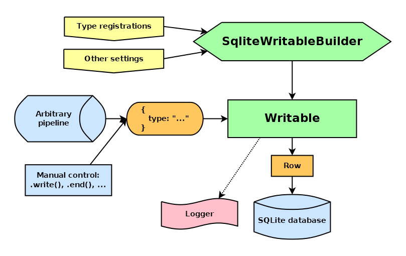

# sqlite-writable

_Writable stream storing objects into a SQLite database_


[](https://badge.fury.io/js/@giancosta86%2Fsqlite-writable)
[](/LICENSE)



**sqlite-writable** provides a `Writable` stream that stores _objects_ into a _SQLite database_.

The stream can be instantiated via a builder and then used just like any standard `Writable` - including `.write()`, `.end()` and pipelines; even `.cork()` and `.uncork()` are perfectly supported.

## Installation

```bash
npm install @giancosta86/sqlite-writable
```

or

```bash
yarn add @giancosta86/sqlite-writable
```

## Usage

The objects passed to the stream must be **plain JavaScript objects having a "type" string field**: as discussed below, such field enables the stream to select the actual SQL code to execute when performing serialization.

To instantiate a new stream, just:

1. create a new instance of `SqliteWritableBuilder`

2. continue the chain via its `.with...()` methods

3. finally, end the chain by calling `.build(db)` - which expects a `Database` object, as exported by [better-sqlite3](https://www.npmjs.com/package/better-sqlite3).

### Example

```typescript
import open, { Database } from "better-sqlite3";
import { SqliteWritableBuilder } from "@giancosta86/sqlite-writable";

type Bear {
  type: "bear";
  name: string;
  age: number;
};

type Chipmunk = {
  type: "chipmunk";
  name: string;
  gatheredNuts: number;
};

const db: Database = open(":memory:");

const writable = new SqliteWritableBuilder()
  .withLogger(logger)
  .withType<Bear>(
    "bear",
    "INSERT INTO bears (name, age) VALUES (?, ?)",
    bear => [bear.name, bear.age]
  )
  .withType<Chipmunk>(
    "chipmunk",
    "INSERT INTO chipmunks (name, gathered_nuts) VALUES (?, ?)",
    chipmunk => [chipmunk.name, chipmunk.gatheredNuts]
  )
  .build(db);
```

### SqliteWritableBuilder settings

`SqliteWritableBuilder` supports the following `.with...()` methods:

- `withType<T>(type, sql, mapper)` performs a **type registration**, telling the stream _how to serialize a given object type_. It requires:

  - **T**, the _type parameter_. It must reference a type containing a **type** field of type `string` - including a string literal, which is actually recommended. For example, a supported type alias could be:

    ```typescript
    type Bear = {
      type: "bear";
      name: string;
      age: number;
    };
    ```

  * **type** is the `string` value that, when found in the **type** field of any object passing through the stream, will associate that object to the current type - thus triggering the related insertion statement.

    In the example above, you would just need to pass `"bear"`. The reason for such duplicated information resides in compiler dynamics - namely, _type erasure_

  * **sql** is the `INSERT` SQL statement used to create the row in the db.

    Within its `VALUES(...)` section, it should contain **?** placeholders to denote the object fields

  * **mapper**: a function taking the current object passed to the stream and returning an arbitrary **array of arguments** to be passed to the insertion statement.

    In other words, the array must contain as many values as the number of **?** placeholders in the SQL statement

- `withLogger(logger?)` registers a logger that will be notified about the stream activities - especially _errors_.

  The logger must comply with the `Logger` interface exported by [@giancosta86/unified-logging](https://github.com/giancosta86/unified-logging).

  **Default**: no logger is used

- `withMaxObjectsInTransaction(number)`: to maximize performance, _the stream batches insertions_ into a single transaction spanning multiple `.write()` calls.

  More precisely, _whenever a successful insertion occurs_, if the number of successful insertions _within the current transaction_ reaches the maximum value declared in the settings, then **the transaction commits** - and a new transaction will be started as subsequent insertions are requested.

  - **Please, note**: advanced users of NodeJS might be pleased to know that `cork()` is supported: _in cork mode, all the insertions take place within the same transaction_; consequently, the **COMMIT statement is only executed when leaving cork mode** - especially via `.uncork()` or `.end()` - **despite the internal counter**

  **Default**: a sensible default value

- `withHighWaterMark(highWaterMark?)`: if defined, it is passed to the stream's base constructor

- `withSignal(signal?)`: if defined, it is passed to `Writable`'s base constructor

## Further reference

For additional examples, please consult the unit tests in the source code repository.
